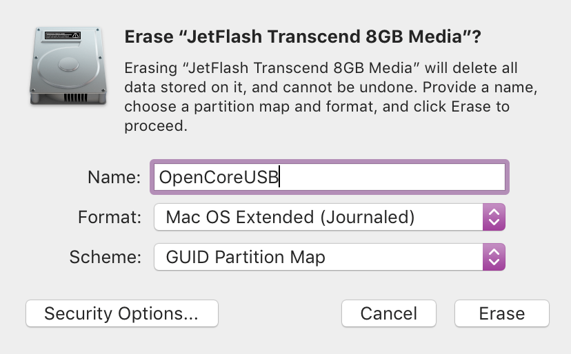
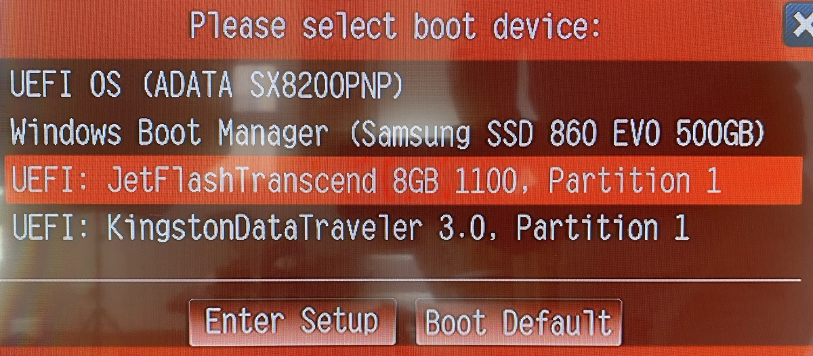

# OpenCore base setup

> This article lists my steps as I prepared OC setup on my MacBook Pro. If you doing this on Windows 10, you’ll need to research what tools and steps are needed for it.

Starting point is the [OpenCore Vanilla desktop guide](https://khronokernel-2.gitbook.io/opencore-vanilla-desktop-guide/). _Vanilla_ means that there is more or less nothing pre-made for you. Each build will be uniquely suited for the given hardware and you’ll see immediately why, in first steps below.

I said it previously and I’ll repeat again: read the entire guide very, very carefully, in its entirety, *before* starting. It really needs multiple readings. 

---

First on the list of steps is setting up the BIOS of the machine into as optimal state as possible.

Have [Recommended BIOS settings](https://khronokernel-2.gitbook.io/opencore-vanilla-desktop-guide/creating-the-usb) open on your Mac (or smartphone) and get into the BIOS of your future Hackintosh. Try to find whatever is mentioned and set it up as recommended. For [ASRock X570 ITX/TB3 motherboard](https://www.asrock.com/mb/AMD/X570%20Phantom%20Gaming-ITXTB3/) with BIOS 2.00:

```
Advanced
 ↳ CPU configuration
   ↳ SVM Mode: Disabled
 ↳ Onboard devices configuration
   ↳ WAN Radio: Enabled
   ↳ Bt On/Off: Enabled
 ↳ ACPI configuration
   ↳ PCIE Devices Power On: Enabled
 ↳ Trusted Computing
   ↳ Security Device Support: Disabled
 ↳ AMD PBS
   ↳ PCIe x16 Bus Interface: Gen3
   ↳ Thunderbolt Support: Enabled
   ↳ Security Level: No Security
	
Security
 ↳ Secure Boot
   ↳ Secure Boot: Disabled

Boot
 ↳ Full Screen Logo: Disabled
 ↳ Fast Boot: Disabled
 ↳ CSM
   ↳ CSM: Disabled
   ↳ Above 4G Decoding: Enabled
```

(it took me 3 tries over several days to find some of the mentioned settings.)

Be aware thât list is not exact science, it is good-natured guess. A collection of tips and settings that worked for *most* people.
Some settings may not exist for your machine. Some settings you may ignore and things would still work; for example, it says to disable Thunderbolt but I left it enabled and it was not an issue for me. YMMV. 

You’ll now prepare a bunch of necessary files then proceed to combine them into working OpenCore configuration.  

## Prepare machine files

Now boot into Windows 10 and install [latest Python release](https://www.python.org/downloads/windows/); look for “Download Windows x86-64 executable installer”.
Absolutely make sure to check _Add Python to PATH_ when you start the installer.


You need Python in order to run the tool from the next step.

---

Download [SSDTTime](https://github.com/corpnewt/SSDTTime) from GitHub. 


Unzip anywhere you want, double-click  the _SSDTTime.bat_ file.


(If you don’t see .bat extension, turn off [Hide file extensions for known types](https://www.file-extensions.org/article/show-and-hide-file-extensions-in-windows-10))

In the SSDTTime console app, first dump the DSDT of your future Hackintosh (option 4):


which is instant:


That DSDT file will remain the current one, so next choose option 2, to build SSDT for fake EC device (this is mentioned in the guide as required file):


If should tell you it did its work and it should look like below:


This is entirely dependent on the hardware you are running it on, so don’t worry if your result is not identical to mine. What matters is that _“Done.”_ at the end.

Return to Main menu then do the same with options 1 and 3. Finally, quit the app and open _Results_ subfolder and you’ll see the fruits of your labor:


Move all those files to your Mac somehow, if you’re like me and that’s where you are preparing OC build. If you are preparing on Windows then cool, leave them be until you need them, later on.

### WTH was this for..? 

SSDT / DSDT is the description of your hardware. Each PC has its own DSDT and anywhere from just a few to dozen SSDT files. These tables are unique for each combination of chipset, CPU, memory, ports, controllers that control those ports, number of slots, type of slots and other connectors etc. It’s such a wide variety of hardware and companies that make them, it’s minor wonder this all works. 

These files, you just generated, are mandatory to make macOS boot possible; they are adapting hardware description tables already present for your hardware in such a way that macOS will accept them and not throw a fit.

Building them manually requires serious levels of [hardware and ACPI](https://khronokernel-2.gitbook.io/opencore-vanilla-desktop-guide/extras/acpi) knowledge. That _SSDT Time_ exists is tremendous help — [thanks CorpNewt](https://github.com/corpnewt)!

## OpenCore setup

Next you’ll need to download the OpenCore itself and other auxiliary / support packages. Download the following zip, using latest version with DEBUG in the name:

- [OpenCorePkg](https://github.com/acidanthera/OpenCorePkg/releases)

Unzip it and take a look inside. You’ll find the `EFI` folder - *copy* that to some other place — that will be your OC boot setup.


Here I removed some `.efi` drivers since they were not needed for my hardware, which is all fairly new (from 2019). Lookup what those EFI drivers do if you have older hardware, as you might be needing them.

### ACPI files

Next step now is to copy all `SSDT-*.aml` files from `SSDTTime/Results` into `EFI/OC/ACPI`. Do not copy `DSDT.aml`. 


Then I renamed `SSDT-EC.aml` into `SSDT-SBRG.aml` because the actual device name referenced inside the file is named `SBRG` so just wanted to avoid confusion for myself.[^1]

### Drivers

The only truly required driver (at least up to OpenCore 0.5.5) is `FwRuntimeServices.efi` since it deals with firmware settings, memory and all that. That’s my understanding, I did not look too deeply into this.

The other two drivers you need are for the file systems that macOS is using: HFS+ and APFS. Drivers for them are located in this package:

- [AppleSupportPkg](https://github.com/acidanthera/AppleSupportPkg/releases)


Pick up the two .efi files and copy them into your `EFI/OC/Drivers` folder.

### Kexts

Okie, now we need some `.kext`s = **K**ernel **Ext**ensions. Download these three:

- [Lilu](https://github.com/acidanthera/Lilu/releases)
- [VirtualSMC](https://github.com/acidanthera/VirtualSMC/releases)
- [WhateverGreen](https://github.com/acidanthera/WhateverGreen/releases)

From there, pickup just the main .kext and put inside `EFI/OC/Kexts`. Now, this is how final EFI structure should look like: 


That is the base minimum of files you need to boot macOS.

## Config.plist

The last step now is the most time-consuming one: go through the [AMD section](https://khronokernel-2.gitbook.io/opencore-vanilla-desktop-guide/amd-config.plist/amd-config) of the OpenCore Vanilla Desktop Guide, configuring each section. 

Read and follow the advice given there for each option and also read its description in the `OpenCorePkg/Docs/Configuration.pdf`. Then set the value in the `config.plist`, re-read again to make sure you did it properly. I will not be going through all those settings, the guide and documentation cover those very well.

Here, I’ll just focus how to reference all the files we put in `EFI/OC`.

---

Where is `config.plist`? You create it yourself. Huge help is that you have an excellent starting point in `OpenCorePkg/Docs/Sample.plist`. Copy that into `EFI/OC` folder and rename it into `config.plist`:


I’ll be using screenshots from PlistEdit Pro from now on, so this is how `config.plist` looks when opened in it:


And this is how that looks like in plain-text editor:

```xml
<?xml version="1.0" encoding="UTF-8"?>
<!DOCTYPE plist PUBLIC "-//Apple//DTD PLIST 1.0//EN" "http://www.apple.com/DTDs/PropertyList-1.0.dtd">
<plist version="1.0">
<dict>
	<key>#WARNING - 1</key>
	<string>This is just a sample. Do NOT try loading it.</string>
	<key>#WARNING - 2</key>
	<string>Ensure you understand EVERY field before booting.</string>
	<key>#WARNING - 3</key>
	<string>In most cases recommended to use Sample.plist</string>
	<key>#WARNING - 4</key>
	<string>Use SampleFull.plist for end of life models: 2011 and older.</string>
	<key>#WARNING - 5</key>
	<string>https://docs.google.com/spreadsheets/d/1kGFz3_kp5xCDRRQpfnIUOvbiHXTmxEgyx97u73ImXXE/edit#gid=0</string>
	<key>ACPI</key>
	<dict>
		<key>Add</key>
		<array>
			<dict>
				<key>Comment</key>
				<string>My custom DSDT</string>
				<key>Enabled</key>
				<false/>
				<key>Path</key>
				<string>DSDT.aml</string>
			</dict>
```

It really, really helps to use a good tool. Text editor is the last resort and as such it’s the most work. So either use PlistEdit Pro or ProperTree or Xcode.

Read the values of the 5 warning keys at the top and then remove them.

### ACPI section

Purpose of this section is tell OpenCore what files it should load from `EFI/OC/ACPI` folder. 

Expand _ACPI/Add_ section and you’ll find 10+ items there. *Those are all samples*, examples what could possibly be added there. Delete all but one item in this section:


Expand the remaining one:


It’s pretty obvious what you need to do:

- write into the `Comment` value whatever you want
- set `Enabled` to `true` (PlistEditPro shows that as YES)
- enter the file name in the `Path` value

I only have two files, so I copied this structure and populated both entries:


In the _ACPI/Block_ section I had nothing to…err, block, so I removed those two sample entries. Also in the _ACPI/Patch_ section.


There’s one more thing you need to do here. We removed the sample ACPI patches but need to add patches specific for our hardware. SSDTTime generated those as well — in `SSDTTime/Results` you’ll probably find `patches_OC.plist`. 


These are ACPI patches required for your specific hardware. Just open that file and copy the entries you find there into _Patch_ section in `config.plist`.

### Kexts section

`.kext` file is nothing but a folder that macOS treats specially. So if you are on Mac, right-click on it, then choose _Show package contents_ to get into the folder and you’ll find the paths you need to specify in this section.


Those 3 .kext files I added, here how they should look like.


Be aware that executable name is not always identical to the `.kext` file name. It’s the most common practice but it does not have to be thus it’s important to always verify `ExecutablePath` is properly set. 

I deleted whatever entries were under _Kexts/Block_, _Kexts/Emulate_ and _Kexts/Patch_. Those were all samples and I did not need them.

What I did need is a set of proper kernel patches required for my machine. My AMD Ryzen 5 3600 CPU is part of the CPU generation that AMD internally code-named 17h. They are [available at the AMD_Vanilla’s repo](https://github.com/AMD-OSX/AMD_Vanilla/tree/opencore/17h) in the opencore branch. So copy all the Patch entries from that file into the same location in your `config.plist`.

These patches is what tricks macOS to think it’s running on Apple’s hardware. They are custom-made for each major macOS version and without them booting into macOS is not possible. Until these become available for each major (10.x) macOS version you should not attempt to upgrade. Upgrading to minor versions (10.15.x) is almost always OK since the patches are the same.

### UEFI section

In the _UEFI/Drivers_ you need to list the names of the .efi files from the `EFI/OC/Drivers` folder. 


Really simple, nothing to it.

### PlatformInfo section

Vanilla guide goes into much more details about this section. I just want to point out the most important aspect.

What OpenCore allows you to do is emulate one of the Apple models. macOS does not work on any hardware; it works on carefully engineered machines made by Apple. Thus you need to choose which Apple model you want to mimic. 


That’s what `SystemProductName` value is for. I chose `iMacPro1,1` as it’s the most recommended one. Again — read up, especially what’s said in the guide and make an informed decision. 

### Finalize config

Now you need to finish-up the rest of the config, [following instructions](https://khronokernel-2.gitbook.io/opencore-vanilla-desktop-guide/amd-config.plist/amd-config) from the Vanilla guide.

Here is the [EFI at this point](EFI-samples/EFI-00.zip) I got setup for my hardware (ASRock X570 ITX/TB3 motherboard, AMD Ryzen 5 3600, RX 570 graphics card). This EFI is just an example, use it as such.

I hope, by taking you through all these steps, I made it very clear why **you should never pickup and use someone else’s EFI folder**. There are many of them posted online. You can look into them and use them as examples but never use them directly. Unless you have *completely identical* hardware as the original creator, it may simply not work or it may work but with various issues — including boot errors, kernel panics, hardware not being recognised etc.

Don’t be lazy.

## Prepare boot USB

Now, the moment arrived for that small USB you had waiting. 

I formatted it as bootable partition, with HFS+/_macOS Extended (Journaled)_ file system using _GUID Partition Map_. Named it _OpenCoreUSB_.



When done, you’ll see OpenCoreUSB disk on your desktop. It’s empty and it’s entirely irrelevant. 🙃 What you need is the hidden EFI system partition (often referred as ESP) on that same disk. To reveal it, you’ll need another tool:

- [mountEFI](https://github.com/corpnewt/MountEFI)

Download, follow the installation steps in the README and execute `MountEFI.command`. This will open the terminal:


Pick the number next to the OpenCoreUSB (do *not* choose your existing MacBook Pro disk), type your password when asked for and it’s done. Quit `mountEFI` and open the EFI partition.

I repeat: be very careful to *not* choose number next to your MacBook Pro disk. If you do that and alter that EFI partition you [will render your MBP un-bootable](https://www.reddit.com/r/hackintosh/comments/g4lw7t/so_bricked_my_real_mac_by_accidentally_installing/).

Now, with EFI shown on the Desktop, open it and you’ll see it’s empty. Copy the EFI folder you have prepared over there.

Ta-da! You’re ready. 

## First boot

Now place both OpenCoreUSB and macOS Installer USB into two ports on the back of your PC and power it up. Make sure to enter into Boot menu and choose OpenCoreUSB stick as boot option. 



After some time it will show you list of bootable disks it found, where you choose macOS Install and fingers crossed, you’ll soon see macOS Installation starting up.


If the macOS installation USB disk is not visible, then place it in some other USB port, reset the PC and try again.

### If it fails to boot

If boot fails, OpenCore will create log file on that same EFI system partition. Thus when you move the USB back to your working Mac and reveal the EFI partition using _mountEFI_, you’ll be able to see that log:


Here’s one typical rookie mistake where I copied `VboxHfs.efi` driver into `EFI/OC/Drivers` but then forgot to correct driver name from the `Sample.plist`:

```
00:000 00:000 OC: OpenCore is now loading (Vault: 0/0, Sign 0/0)...
…
01:747 00:039 OC: Got 3 drivers
01:787 00:040 OC: Driver HfsPlus.efi at 0 is being loaded...
01:827 00:040 OC: Driver HfsPlus.efi at 0 cannot be found!
```

So yeah. Mistakes will happen. Edit `config.plist` then try again. Consult the guide if needed, this time looking at [General Troubleshooting](https://khronokernel-2.gitbook.io/opencore-vanilla-desktop-guide/troubleshooting/troubleshooting) section and try again. And again until you get it right.

When you find one EFI setup that works, make a backup copy somewhere safe and continue tweaking on. But make sure to always have a backup copy of the last EFI that booted successfully.

---

This is the base minimum to attempt macOS installation. Your network will probably not work, nor WiFi/Bluetooth, nor audio. But you should be able to complete the installation process with USB-based mouse and keyboard.

Make sure that on each restart during installation you enter Boot menu and choose OpenCoreUSB stick as boot disk (or set it as primary boot option in BIOS). Everything else will work automatically during macOS installation restarts without you having to do anything.

You can now brag on Reddit or wherever with your “About This Mac” screenshot. ;) You’re still far away from calling this a success but it’s an important first step.

Depending on the hardware you have, you are 20% done or 50% done or anything in between. What, you thought it’s almost done? Eh…

[^1]: EC is the same kind of device in Intel land, I believe.
