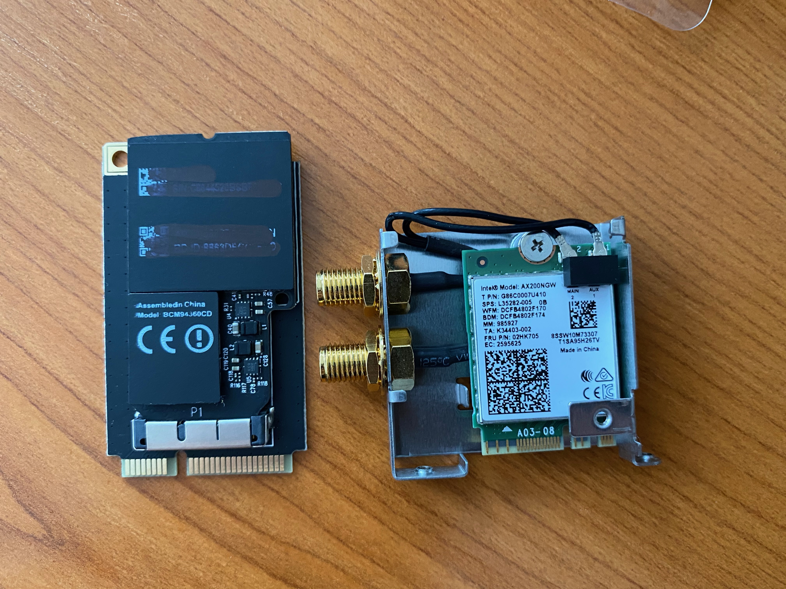
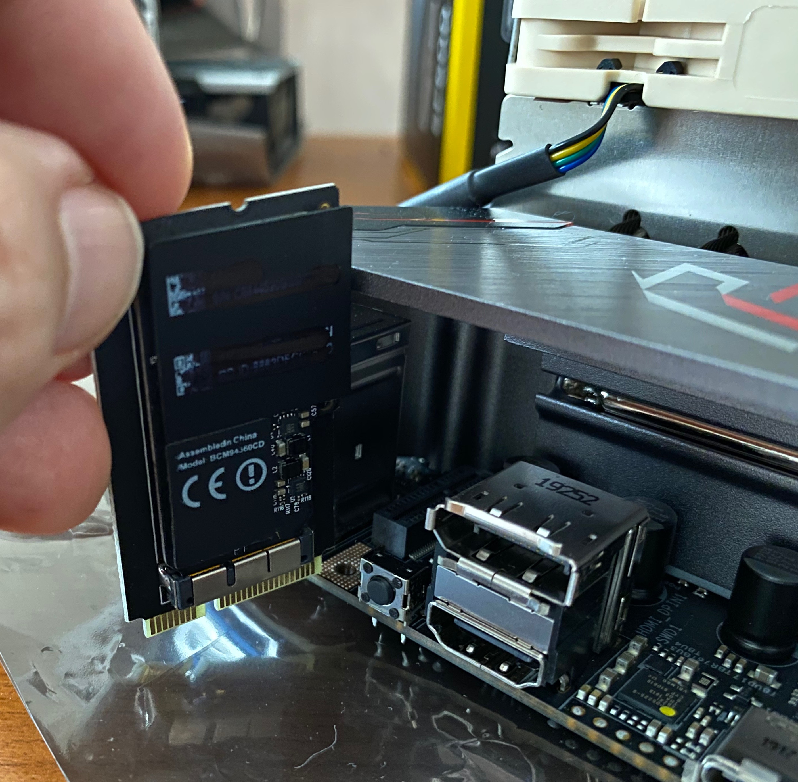
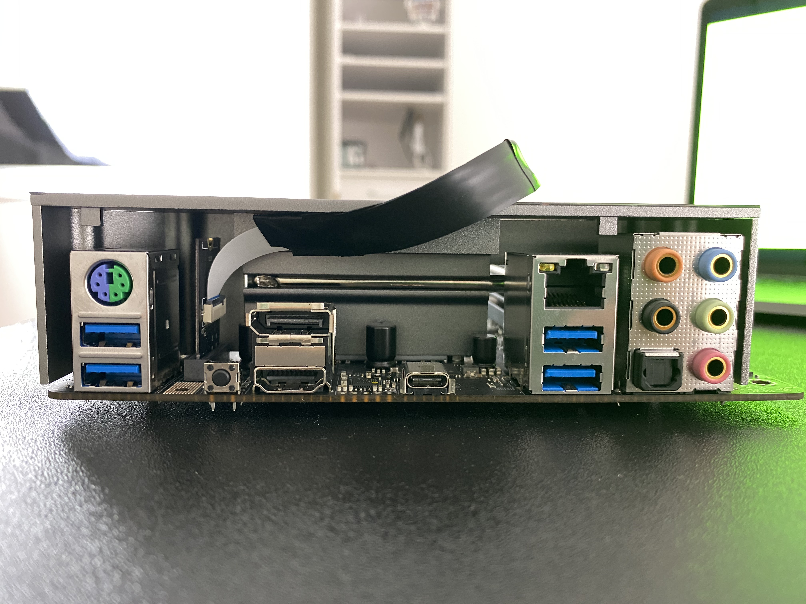
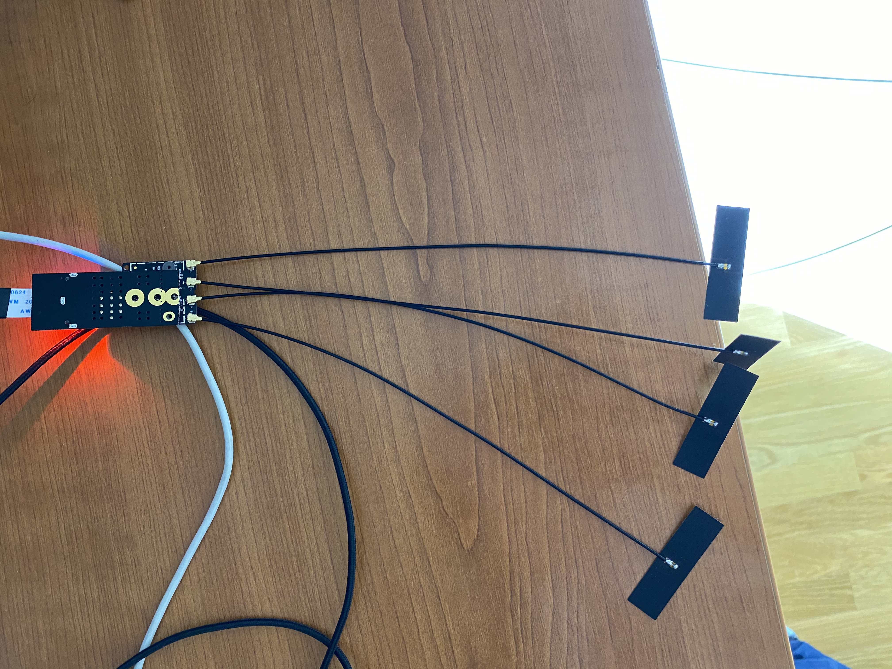
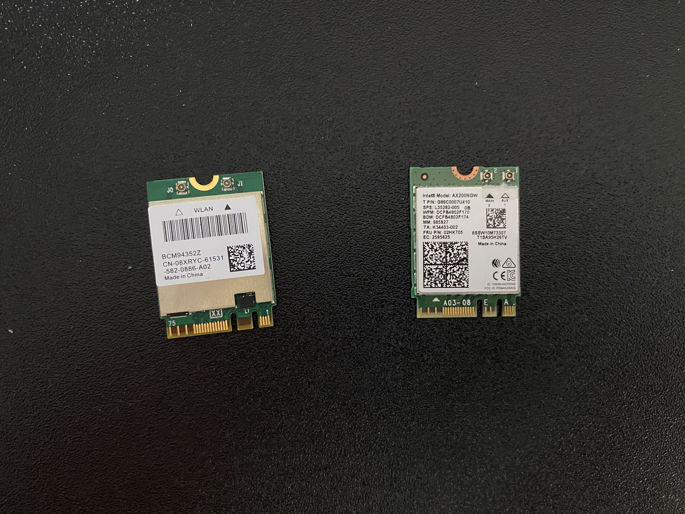
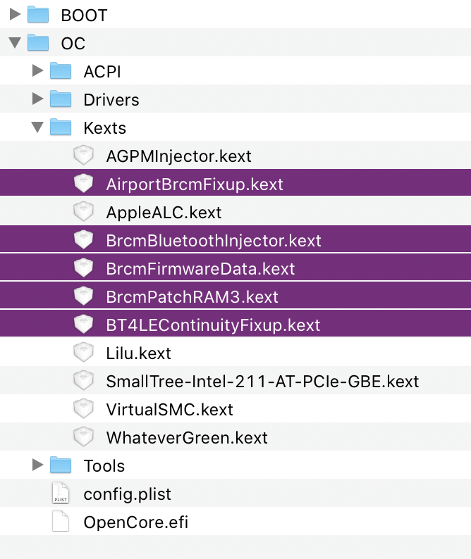
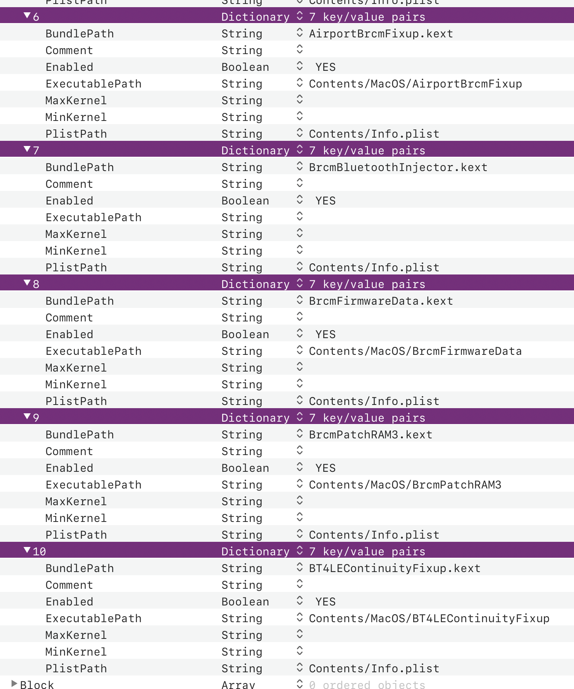
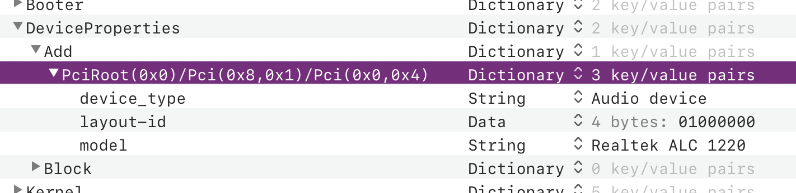

# Network and Audio setup with OpenCore

Setting up network & audio interfaces can be anything between trivial and impossible.

## Ethernet, LAN

My ASRock X570 board has Intel’s I211AT Ethernet (LAN) controller. Some good soul wrote [appropriate `.kext`](https://cdn.discordapp.com/attachments/390417931659378688/556912824228773888/SmallTree-Intel-211-AT-PCIe-GBE.kext.zip) for that controller, link to which I found through [this reddit comment](https://www.reddit.com/r/hackintosh/comments/cuhtgw/new_x570_build_intel_i211at_lan_and_80211ax/f0ads71/). I know, it sounds crazy to download from random links like that but such are the waters you are swimming in now. What I later found out is that there’s a repository of various .kexts which seems to be continuously updated but I can’t find its link at the moment.

With that particular kext integrated and referenced from the OC’s `config.plist`, I got perfectly working Ethernet in macOS. 

Wireless is much harder story.

## WiFi, Bluetooth

My motherboard integrates [Intel’s AX200 wireless module](https://www.intel.com/content/www/us/en/products/wireless/wi-fi-6-series/wi-fi-6-ax200.html) — a tiny wonder of a card which brings WiFi 6 and Bluetooth 5. Sadly, that card can’t possibly work under macOS as there are simply no drivers (although there’s at least [one person attempting](https://github.com/zxystd) to write them). 

Thus I needed something that Apple itself is (or was) using. If you search through Amazon or eBay or AliExpress, you’ll find multiple items ready-made for Hackintosh builds using Broadcom chips that Apple was using in older Macs. You can even buy the original Apple cards salvaged from some broken-down Macs. But they are rarely just plug and play – you need to do either hardware or software mods. Or both.

### Option 1: BCM94360CD

I bought this card on AliExpress:

- 1750Mbps Dual Band WiFi 2.4GHz/5GHz / Bluetooth 4.0 [Broadcom BCM94360CD](https://www.aliexpress.com/item/1750Mbps-Dual-Band-WiFi-Bluetooth-Card-2-4GHz-5GHz-BT-4-0-Broadcom-BCM94360CD-Wireless-Module/32974196141.html) card



Because this card was designed for use in MacBooks / iMacs, it can’t be directly plugged in here (it’s a different connector). Hence the need for an [adapter card](https://www.aliexpress.com/item/MINI-PCI-E-Adapter-Converter-to-wireless-wifi-card-BCM94360CD-BCM94331CD-BCM94360CS-BCM94360CS2-module-for-macbook/32256494722.html). But it was still not possible.



It’s taller than Intel’s card (AX200 really is amazingly small) and X570 motherboards usually have integrated heat sinks over their I/O area. Thus in the end I used this:

- Mini [PCIe riser with adapter](https://www.aliexpress.com/item/BCM94360CD-BCM94360CS2-BCM943224PCIEBT2-Card-To-M-2-Key-A-E-Cable-For-Mac-OS-and-and/4000286967003.html) for M.2 Key A/E



This turned out great since I could lift the wireless card out of the I/O and get much better reception when I attached 4 IPX MFH4 antenna receptors to it (you get 2 of these with the adapter and more can be found on AliExpress for few bucks). 



It’s really a hodgepodge contraption 🙃 but these antennas are so tiny and flexible that I could attach them to the inside of the chassis since they take up way less space than original antennas delivered along with the motherboard. Thus the final build is a clean, compact machine that looks great.

With that mod, I had perfect WiFi 5 and BT 4.0 in macOS, with no additional software required. It acts and works as native Apple hardware. 

So if you can, use cards based on BCM94360 chips (there are several variants: CD, CS2, maybe more). Contraption or not, they truly work out of the box.

### Option 2: BCM94352Z or similar

Another option is to use [different card](https://www.aliexpress.com/item/Dual-band-Wireless-Hackintosh-BCM94352Z-WIFI-Card-Broadcom-bcm94352-M-2-Bluetooth-4-0-Network-NGFF/32464748097.html) which is physically identical to Intel AX200. 



But that card is based on older Broadcom chip (BCM94352Z) which requires 4 different `.kext`s for WiFi and Bluetooth to work:



Pay attentions to the order of loading, FirmwareData must be loaded before the PatchRAM:



Download the kexts through these links:

- [AirportBrcmFixup](https://github.com/acidanthera/AirportBrcmFixup/releases)
- [BrcmPatchRAM](https://github.com/acidanthera/BrcmPatchRAMreleases/releases)
- [BT4LEContinuityFixup](https://github.com/acidanthera/BT4LEContinuityFixup/releases)

Even with all that it seems that Apple Watch unlock is not really working although it’s advertised as _Supported_ in System Information and initial setup goes through. As you can see I added `BT4LEContinuityFixup.kext` but I’m not sure it’s doing anything useful here.

## Audio

If you connect your monitor using HDMI, you’ll have sound working just fine with this particular card (Sapphire RX570 Nitro+). Graphics card and its HDMI Audio device are recognised by macOS out of the box. 

The heart of audio support is this particular kext:

- [AppleALC](https://github.com/acidanthera/AppleALC/releases)

To use back ports (those colorful surround loveliness at the back I/O panel), you’ll need to know the exact codec name. Usually, motherboard’s technical specifications page will spell it out. 

My ASRock X570 ITX/TB3 board integrates _7.1 CH HD Audio with Content Protection (Realtek ALC1220 Audio Codec)_. Armed with that knowledge, [open this page](https://github.com/acidanthera/AppleALC/wiki/Supported-codecs) and hope the codec is already there. Realtek audio chips are extremely common thus no surprise that I found it in the list.

I ran tool called [gfxutil](https://github.com/acidanthera/gfxutil) on the target machine, to get the PCI device path for the audio codec:

```
$ ./gfxutil -f HDEF
PciRoot(0x0)/Pci(0x8,0x1)/Pci(0x0,0x4)
```

Now in `config.plist`, under _Device Properties/Add_, create new Dictionary named exactly as the result above and include the following key/value pairs:

```xml
<dict>
	<key>PciRoot(0x0)/Pci(0x8,0x1)/Pci(0x0,0x4)</key>
	<dict>
		<key>device_type</key>
		<string>Audio device</string>
		<key>layout-id</key>
		<data>AQAAAA==</data>
		<key>model</key>
		<string>Realtek ALC 1220</string>
	</dict>
</dict>
```

That garbled `layout-id` value you see is encoded number `1` (from the previously mentioned list of codecs) into `Data` binary blob expected as the value of that key. Because these byte-level Data conversions are hard as frakk to do manually, I let [PlistEdit Pro](https://www.fatcatsoftware.com/plisteditpro/) to handle this for me: I input `01` and it does the conversion. 



After booting with that EFI, open System Preferences / Sound, under Output you should see the lovely list of audio devices – make sure to select _Internal Speakers_ there.

Now, to test, plug your headphones into the green port on the back I/O panel and play any audio (I went to YouTube). If you hear the sound, you’re fine. If not, try some other value for `layout-id`. Rinse and repeat until you get one that works.

Microphone support for AMD systems is still missing, thus make sure to follow-up with [AppleALC](https://github.com/acidanthera/AppleALC) future development. Until then, that pink jack at the back will be useless and you can try using some USB-based microphone.

If your USB ports are even working. Why they wouldn’t be? Ooh, welcome to the world of hurt.
