slug: usb-mapping-how

With the problem of USB mapping explained in the previous article, now we need to see how to workaround it. The ultimate goal is to have all the available ports that we want working, as both USB 2.0/3.0.

There are some interesting articles on this topic:

- [USB Map](https://usb-map.gitbook.io/project/terms-of-endearment) by CorpNewt, useful for historical perspective and Intel-based machines.
- [The New Beginner's Guide](https://www.tonymacx86.com/threads/the-new-beginners-guide-to-usb-port-configuration.286553/#post-2029768) to USB Port Configuration, uses Hackintool which lists active port configuration in its USB tab. I found its display to be confusing and incorrect. Probably works OK for Intel machines.
- [AMD USB Map](https://github.com/khronokernel/Opencore-Vanilla-Desktop-Guide/blob/master/AMD/AMD-USB-map.md) part of OpenCore Vanilla Desktop Guide, which is the only one related to AMD stuff but also way too terse.

General rule for AMD builds: *ignore* any guide that tells you to use [USBInjectAll](https://github.com/RehabMan/OS-X-USB-Inject-All) kext and/or [USBMap](https://github.com/corpnewt/USBMap) tool. They were made for Intel-based builds and do not work with AMD chipsets, at all.

# How-to: USB mapping

Remember:

- OpenCore is not altering macOS in any way. Which means no kexts are placed inside `/System/Library/Extensions`.
- OpenCore kexts are loaded before macOS loads its own.
- Thus .kext applied by macOS can’t be overridden.

So in my case, I can’t override `iMacPro1,1-XHC1` mapping from previous article. Whatever I do, macOS will apply that map and hide my ports 1 and 9. `XHC1` string is used in two places:

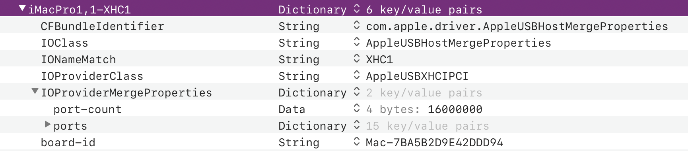

- in the `key` itself: `iMacPro1,1-XHC1`
- as the value of the `IONameMatch` key

Thus the only course of action is to rename that controller so Apple’s map – which is based on “XHC1” value in the `IONameMatch` – has no physical ports to work with.[^1]

That brings me to another problem. Since the `.kext` mapping is based on such a simple string name, I can’t use `XHC0` for two different controllers – I need to rename one of them into something else.

Hence, will remap `XHC1` into `XHCI` and also rename second `XHC0` (under GP13) into `XHC2`. This will be done using two custom SSDT files:

- [SSDT-XHC1-to-XHCI.aml](efi-samples/SSDT-XHC1-to-XHCI.aml)
- [SSDT-GP13.XHC0-to-XHC2.aml](efi-samples/SSDT-GP13.XHC0-to-XHC2.aml)

I created these two files following the samples available in the Vanilla desktop guide.[^2] I lack the  knowledge to write these from scratch and I’m grateful those samples are available.

With those two files added into `config.plist`, all of my ports were working and I did not need to create any .kexts because all 3 controllers have less than 15 ports (10, 10 and 8).

So, job done, for me, without actually doing any port mapping, at all. When do you need a specific map?

> Port mapping means that you know exactly which physical port maps into which logical software port, both for USB 2.0 and 3.0 paths.

This is fairly easy to do, with one caveat: what if your ACPI setup yields more than 15 ports per (one of the) controllers? macOS will ignore the upper ones and you’ll be unable to complete the mapping. 

In that case – and only in that case – you need to *temporarily* apply a kernel patch to disable that limit. That patching is notoriously buggy and unstable thus you need to enable it only for the purpose of mapping out your ports and then disable it. In OpenCore, patching is enabled by simply turning value of `XhciPortLimit` key to `true` (`YES`) in `config.plist`:

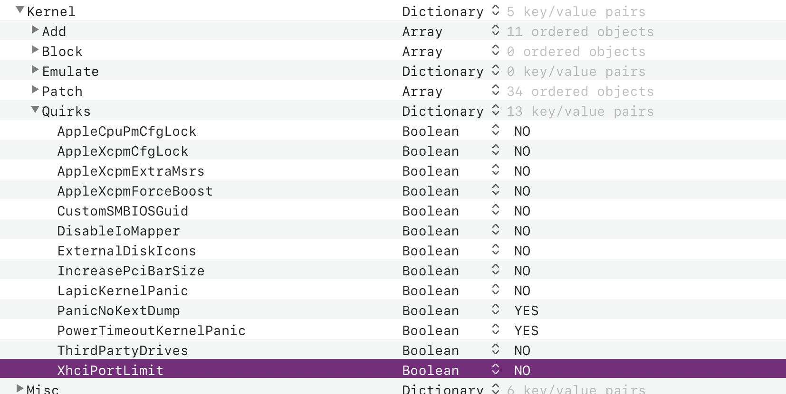

## Building the map

Now, you need to draw yourself a map of the ports you are interested in and get ready to fill-in the details. Here’s how that looked like for me:

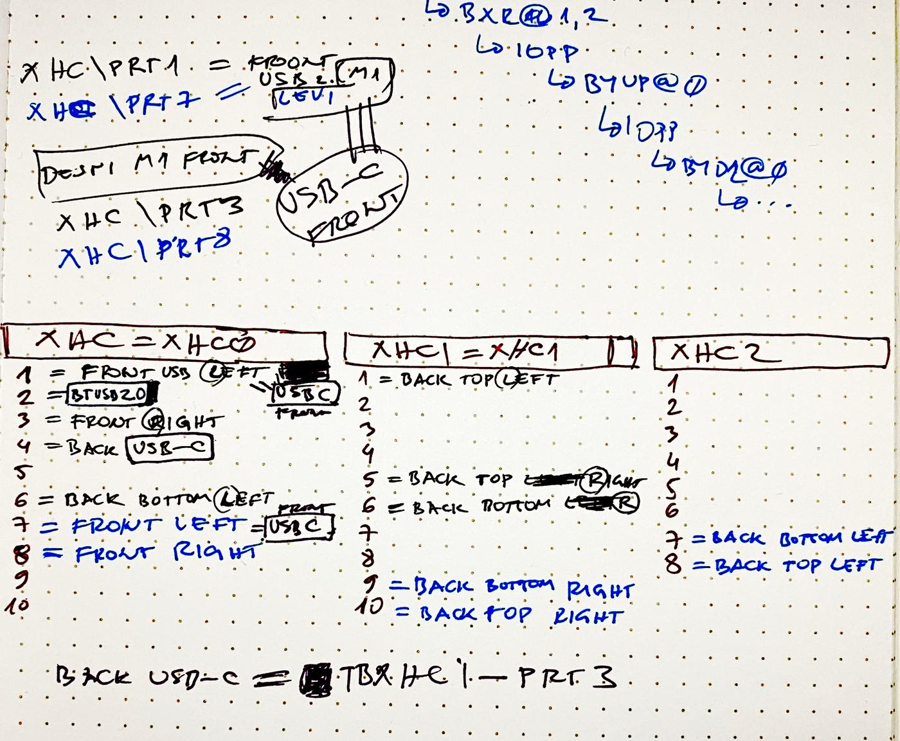

To build the map, you’ll use IORegistryExplorer. Start it up, make sure that nothing is added into the Search field and scroll down to where the XHC controllers are. Ideally, you would be using Bluetooth mouse and keyboard, which will leave all the USB ports empty and ready to identify, one by one. 

If you do use USB mouse / keyboard then they will already appear, attached to their respective ports:

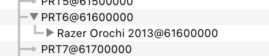

Mouse and keyboard are usually USB 2.0 devices, so you can immediately mark those logical ports as USB 2.0.

One of the ports will also be taken as Bluetooth USB 2.0 hub – all Bluetooth connected devices will appear here – for me that was `XHC0/PRT2`:

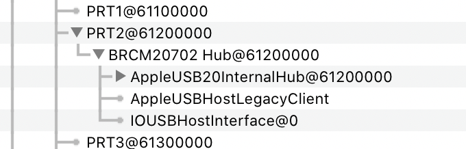

But, that aside, what is the best way to mark ports as either USB 3.0 or USB 2.0? You need device(s) that are 2.0/3.0 and plug them in. The best solution is to use external USB hub like the one I have here, [from Anker](https://www.anker.com/products/variant/4port-usb-30-ultra-slim-data-hub/A7516011):

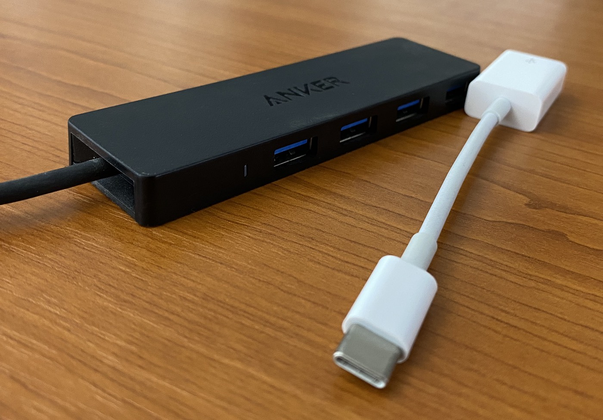

What’s so great about it? It registers itself as both USB 2.0 and USB 3.0 device when plugged-in. In  IORegExplorer, this looks like this:

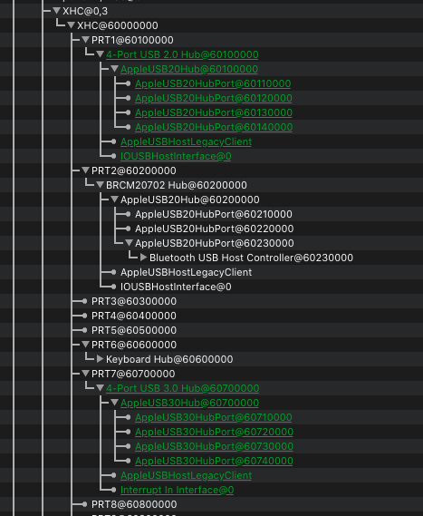

Plugged-in device appears as green and clearly shows as 2.0 or 3.0 hub under its respective logical ports. When you pull the device out, these green lines become red and strike-through. With this, you know exactly how given physical USB port maps into logical ports.

Now you simply go through all the ports you have and entire map is done in like 10 minutes. For USB-C ports, I used Apple’s USB-A to USB-C adapter and plugged Anker’s hub that way. 

That’s it, really. You have done your mapping. Don’t forget that motherboards have special USB connectors for USB-ports on the chassis. Depending on what kind of PC case you have, maybe you don’t have them connected. But if you do, procedure is the same with those ports too.

In the end, you will know which of the logical ports are used and which are not, for your specific hardware. All that’s left to do is create the .kext file.

### Creating the USB-map.kext

Vanilla guide explains the [important details](https://github.com/khronokernel/Opencore-Vanilla-Desktop-Guide/blob/master/AMD/AMD-USB-map.md) of the structure you need to create, look for “So what kind of data do we shove into this plist?” on that page. 

But that sample did not work for me, because it seems based on Mojave structure of the .kext, where Apple used `IOKitPersonalities` as the key while in Catalina it’s `IOKitPersonalities_x86_64`.  So here’s [my sample .kext](efi-samples/USB-map-Catalina.kext), which you can use to build upon.

The top of the plist can be used to specify which manufacturer (maker) and which model is that kext for.

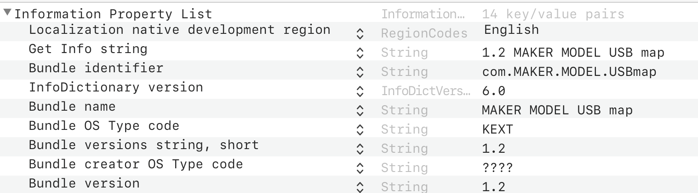

Then inside the mentioned `IOKitPersonalities_x86_64` dictionary, you need to create another dictionary named as in this example:

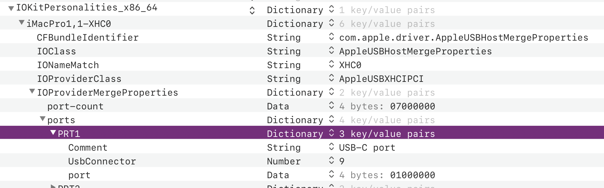

where the most important part is to specify correct `IONameMatch` value. The rest of the values should hopefully rename the same, I simply copied them from Apple’s kext. 

Inside the port structure, `UsbConnector` is a number that specifies type of the port, already explained in the guide:

```
0: USB 2.0 Type-A connector
3: USB 3.0 Type-A connector
8: Type C connector - USB 2.0-only
9: Type C connector - USB 2.0 and USB 3.0 with Switch, flipping the device **doesn't** change the ACPI port
10: Type C connector - USB 2.0 and USB 3.0 without Switch, flipping the device **does** change the ACPI port
255: Proprietary connector - For Internal USB ports like Bluetooth
```

Note that these values should already be specified for you, by the DSDT/SSDT. Type of connector is this part:

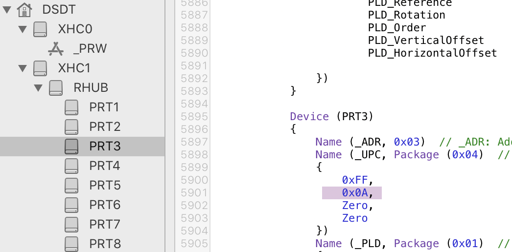

but I’m not sure this is always true though. I’ll need to see a lot of devices and configs to draw some firm conclusions. Here’s how the back I/O panel looks like for my motherboard:

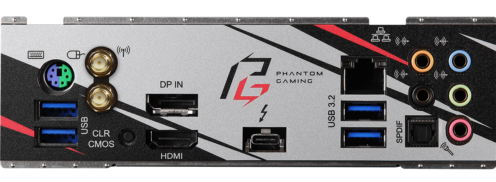

All ports there are USB-A 3.x (thus using `UsbConnector` value of `3`), except the TB3 port which is Type-C thus making it `9` as I did not notice any changes in the port map when flipping the cable. 

When I briefly tested the motherboard in a case which has front USB-C port (connected to the 19pin connector on the mb), that port mapped into `XHC0/PRT1` (USB 2.0 logical port) and `PRT7` (USB 3.0 logical port). 

When I tried a different cable, one that goes from same 19pin connector on mb but splits into two USB-A 3.0 physical ports, then one of those two mapped into that same `PRT1`+`PRT7` pair while the other one mapped into `PRT3`+`PRT8`. 

Which confirms my earlier note that full port mapping depends on the number of ports connected to every possible connector on the motherboard. So if it seems to you that some ports are unused, make sure to re-test that if you change cases where the PC build is housed-in.

`port` must be specified as `Data`; here I type just `03` and let PlistEdit Pro convert that for me. Don’t forget: port numbers are hexadecimal when entered into the value field thus port `10` is `0A`, `11` is `0B` etc. 

Now, when you complete the map for the controller, take the highest port *value* and copy it one level up, as value for `port-count` key. The name of this key is confusing since it does not mean “total number of ports” but “highest port number used” instead.

Here’s what I ended up with:

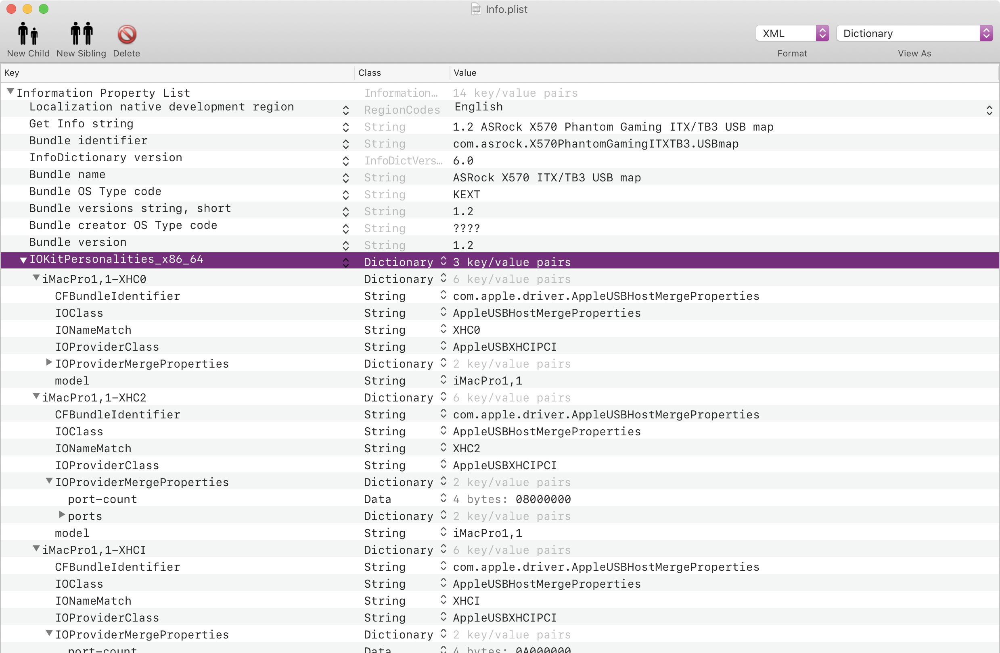

Download that [full USB-map.kext](efi-samples/USBMap-ASRock-X570-Phantom-Gaming-ITX-TB3.kext) I created for my motherboard. It maps all back I/O ports + one USB-C front chassis port connected to motherboard 19-pin connector. *Use it as example.*

Place your USB map kext into `EFI/OC/Kexts` and add an entry for it in `config.plist`. With all that loaded, I got this display in IOReg:

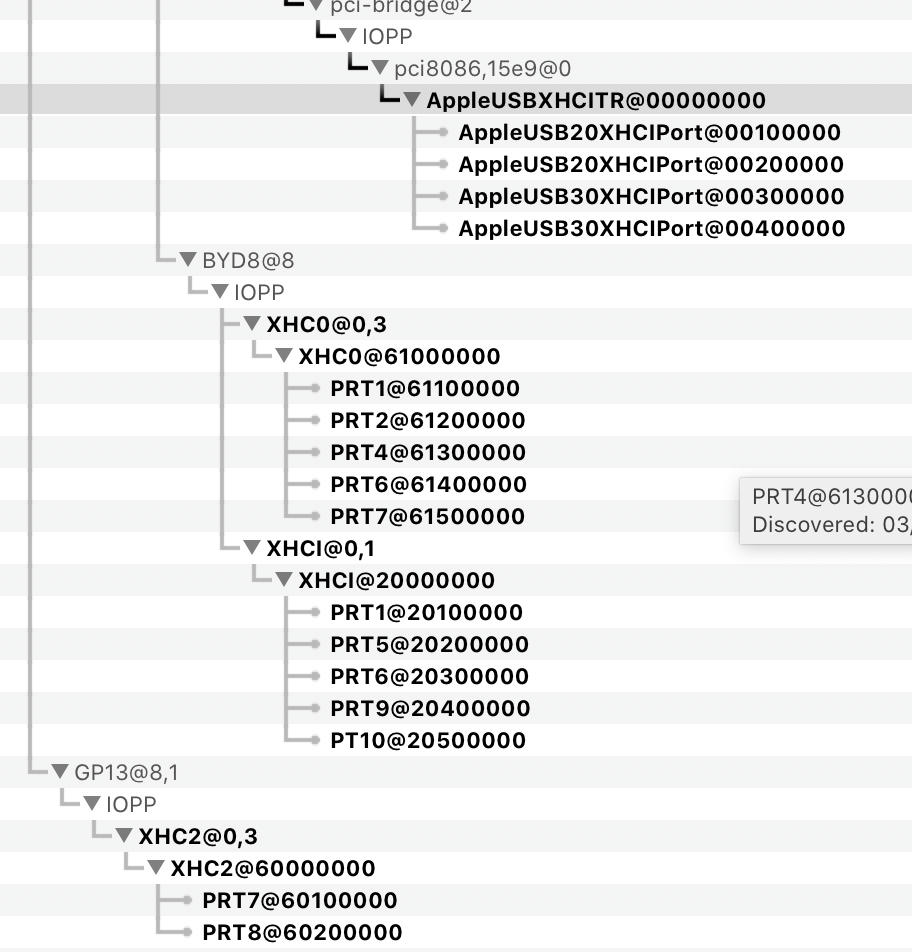

You can see I did not re-map `XHCITR` as I don’t know how. I’m not sure how to reference it in SSDT nor in the .kext but fortunately I don’t have to since it just works. Its PRT3 is the USB 3.0 logical port for the back USB-C / TB3.

That’s all. Happy port hunting!

[^1]: It’s really interesting that with custom SSDT you can rename devices as you want and thus change hardware configuration etc. Crazy stuff. Here’s some starting links if you want to learn more: [Getting started with ACPI](https://khronokernel-2.gitbook.io/opencore-vanilla-desktop-guide/extras/acpi), A layman's guide to [creating a custom SSDT](https://www.reddit.com/r/hackintosh/comments/bwjj73/a_laymans_guide_to_creating_a_custom_ssdt/)

[^2]: I think that Mykola wrote SSDT-XHC2.aml sample specifically for this ASRock board, since someone else who has the same motherboard asked him what to do on the Discord channel.