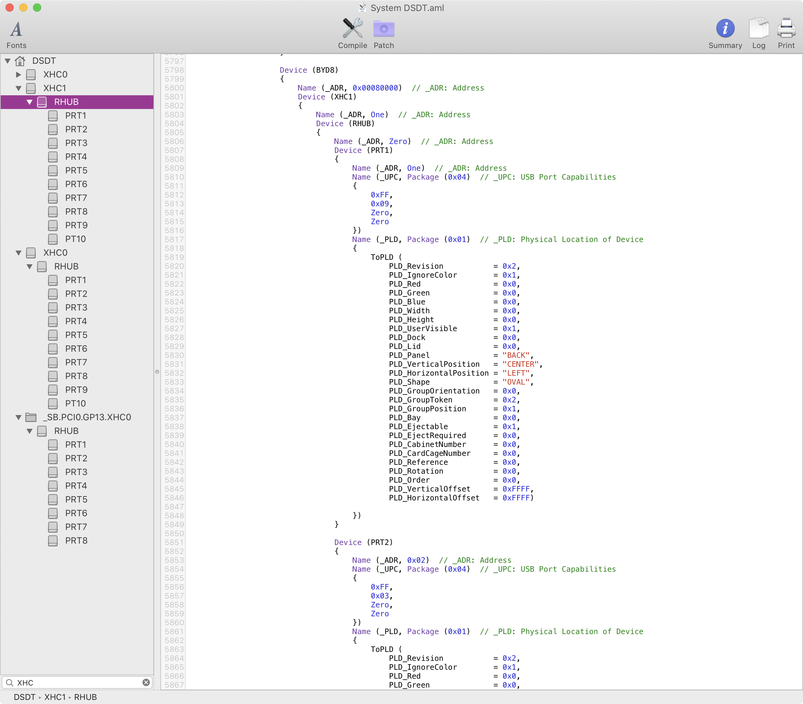
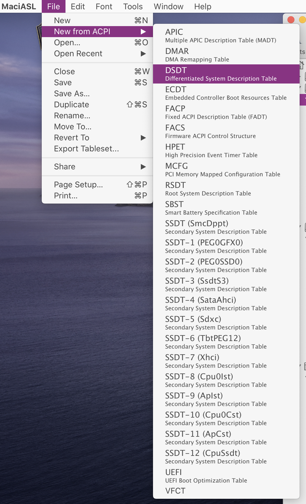
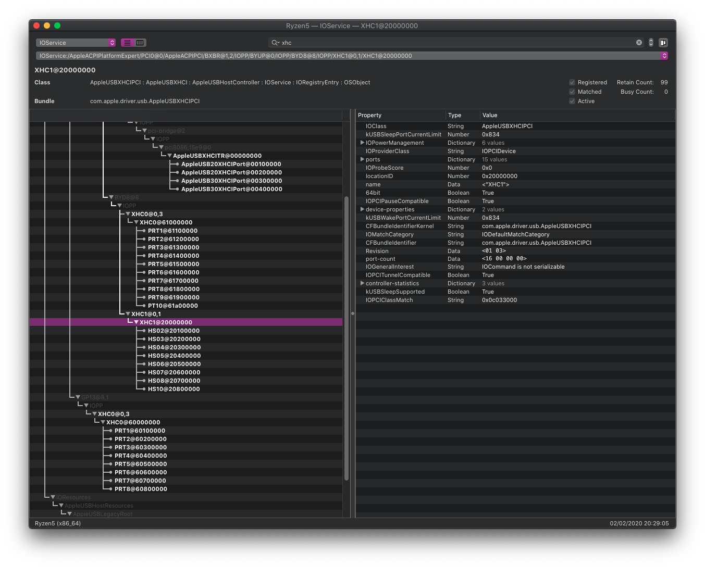
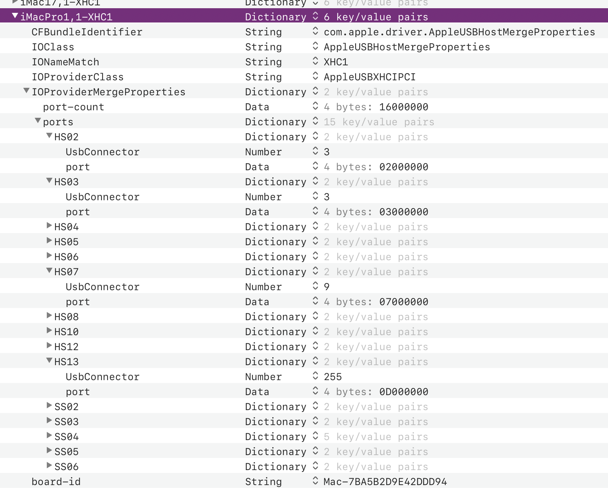
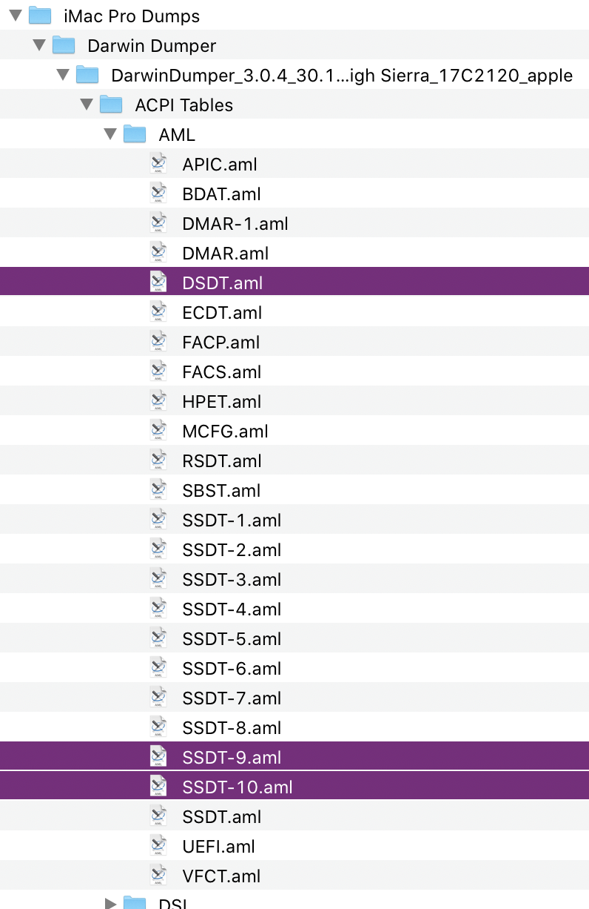
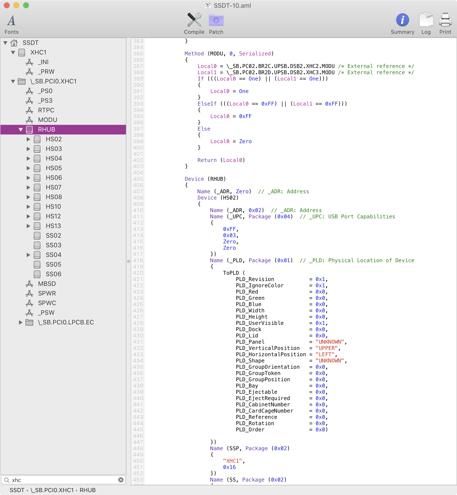
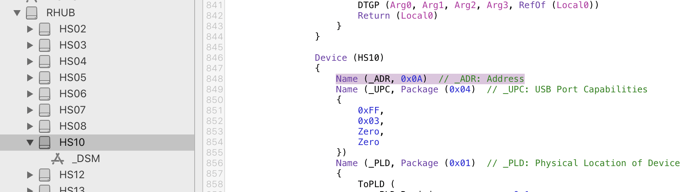
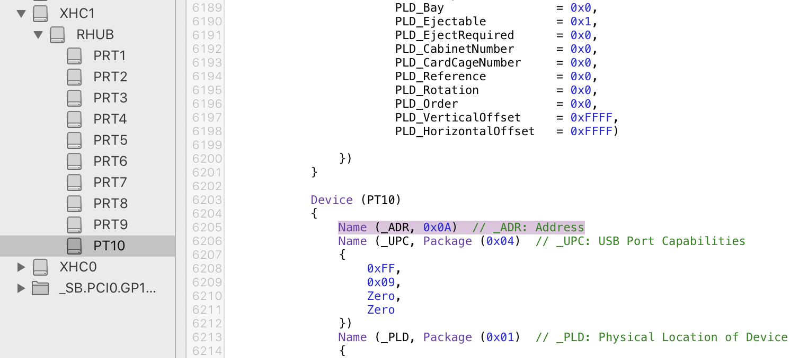

slug: usb-mapping-why

This was the most infuriating part of Hackintoshing for me. There are so many outdated, confusing, incomplete and downright wrong articles and forums posts, it beggars belief. Even for Intel-based Hacks, let alone AMD ones. 
Main issue is mix-up of historical context one needs to be aware of, with bewildering amount of inside-the-racket jargon that’s hard to grasp.

After spending multiple days on this alone I can say that *none* of the available guides is entirely correct nor clear what you should do and more importantly *why you should do what they tell you to do*. 

# Why you need to care about USB mapping

When you choose some Mac model to emulate – say iMacPro1,1 – macOS will load USB hardware map for that particular machine. Apple knows exactly what their models use as hardware configuration so they don’t really need to scan for available ports or other hardware (like Windows or Linux must do). Everything is known before-hand. One thing they know is that none of their machines have more than dozen ports per USB controller thus in 10.11 (El Capitan) they introduced hard limit of 15 ports per controller. 

On the other hand, general PC hardware is infinitely varying. Most motherboards feature large number of internal and external ports. It’s not uncommon to see 6-8 or even more USB ports on the back panel I/O. Additional ports which are present on chassis are connected to internal points on the motherboard. Each USB 3.0 port is also backwards compatible with USB 2.0 hence each physical port is counted as 2 logical ports. Then you have USB-C ports which are USB 3.0/2.0 compatible but are reversible so they need to be treated a bit special. 

In general, depending on the chipset and motherboard features, that 15-port limit can be easily blown.

Saving point here is that there are usually multiple USB controllers in PC hardware; how many, it depends on the chipset and manufacturer choices. External USB hubs and other devices do not count here, since whatever you attach shares that one port where it’s attached.

What all this means in practice?

Most obvious consequence is that some of those ports you have will simply not work. macOS will ignore any port enumerated over 15th on particular controller. There is no specific logic which ones will that be but usually it first enumerates USB 2.0 and then 3.0 logical ports. It’s possible that some ports will be ignored even if they are below 15th, simply due to enforced port map of the emulated Mac; on my ASRock motherboard, ports 1 and 9 were removed on one of the 3 controllers.

As you’ll see, this map is not sequential and physical ports map to (more or less) random positions in the logical map.

## Tools

You will need these two tools and you’ll run them on your Hackintosh.

* [MaciASL](https://github.com/acidanthera/MaciASL) – automatically reads DSDT/SSDTs for the machine, can create new SSDT files in ASL format.
* IORegistryExplorer to browse active ACPI setup. You can find this tool all over the Internet but if you have an Apple developer account, you can find it as part of Xcode 11 additional tools. 

## Know your hardware

When MaciASL opens, it automatically loads DSDT for the current system. You can filter that list of devices in the bottom part of the left panel and here I’m filtering per “XHC”.[^1]

So AMD’s X570 chipset on ASRock ITX/TB3 motherboard has 3 USB controllers. You can see two of them have 10 ports and one has 8 ports. Thus in theory, I should have no problem and all my ports should be working out of the box.

That’s only part of the story. DSDT can be augmented by manufacturer through a series of SSDTs. I assume this is done in layers because it allows them to have a base setup for particular chipset series and then customised for each particular model. 

MaciASL can show you what SSDTs are active for the hardware. Here’s a screenshot when MaciASL is ran on MacBookPro13,3:

These additional tables can add, alter and/or hide devices you see in the DSDT.

Third layer of customisation is through OS device drivers. On macOS, this is done through .kexts. This third layer is primary source of confusion related to USB mapping for Hackintoshes. (More on that below.)

Thus to summarize:

- DSDT / SSDT = coming through ACPI (firmware, I guess)
- OS drivers (kexts) = specified in macOS

Now, when you run macOS on Apple’s hardware, Apple is the author of both the ACPI tables and kexts. When you run on non-Apple hardware, then original manufacturer (in my case ASRock) has done the ACPI part while Apple of course does macOS part.

Your final XHCI configuration — known as USB map in Hackintosh circles — is combination of these 3 layers: DSDT / SSDT / kexts. To see that final result, use IORegistryExplorer which will display all devices it finds on your system. When filtered per “XHC”, this is what it showed for my build:

Look closely and you’ll see a couple of strange things.

1. Ports listed under XHC1 controller are not named `PRTx` (as the DSDT declared) but are actually `HSxx`
2. Ports 1 and 9 are missing under XHC1
3. There’re two controllers named XHC0
4. There’s an additional XHCITR controller

Last discuss from bottom to the top. 

This motherboard has Thunderbolt 3 port at the back I/O, managed by special TB3 controller. TB3 is also acting as regular USB-C port thus it has its own paired XHCI controller for that. So my motherboard has 3 XHCI controllers from the X570 chipset + 1 additional coming from (Titan Ridge) Thunderbolt 3.

The chipset has two XHC0 controllers but they are wired through different paths. It’s unfortunate for us that they are called the same (you’ll see why in the next article) but they are not problematic in general since they appear exactly as DSDT specifies.

XHC1 is the problem. Not only are ports renamed, two of them are missing. You probably already suspect why — macOS specifies an additional .kext that alters the port mapping setup in the hardware.

## Know what you emulate

In my OC build, I chose to emulate iMacPro1,1 model. Thus the .kext macOS applies must be somehow connected to that particular machine.

Where are those .kext maps located? In `/System/Library/Extensions` and then:

- in Mojave:\
`IOUSBHostFamily.kext/Contents/PlugIns/`
`AppleUSBXHCIPCI.kext/Contents/Info.plist`
- in Catalina:\
`IOUSBHostFamily.kext/Contents/PlugIns/`\
`AppleUSBHostPlatformProperties.kext/Contents/Info.plist`

> I mentioned Mojave to point out just how much stuff can change. They did not change just the file location but also the internal structure. This is one more reason why you should never rush to update to major macOS releases. With the push towards DriverKit, kext are going away and who knows what’s going to change in 10.16.

When you open this Catalina .plist, this is the setup you’ll see:

Well, well, well…You can see that this map for `XHC1` on `iMacPro1,1` essentially overwrites ACPI setup for `XHC1`. Like it was never there…or?

Look closer though: this map also specifies SS02-SS06 ports which do not appear in the IORegistryExplorer. So what happens with those ports..?

To understand that, we need to look at the ACPI tables from the actual iMacPro, not from my build. If you know owner of one, you can ask them to run MaciASL for you 😉. Or you can look at [this library](https://applelife.ru/threads/dampy-originalnyx-makov.2943712/) of complete system dumps of various Mac models and find the one that interests you. For iMacPro, you’ll find the DSDT and 11 SSDTs:

DSDT has no XHCI setup, at all. XHC1 is declared in SSDT-10:

(SSDT-9 is also interesting, since it declares Thunderbolt 3 hardware.)

And there you go. SSDT declares all the possible ports and then .kext augments that list by hiding (and possibly renaming) some ports. But the .kext can’t manufacture ports in software - they must exist in hardware.

This is why in my build, which has 10 hardware ports under XHC1, I don’t see anything below HS10. But why is HS10 the last one visible, why not HS13? If you count the ports, my XHC1 has 10, while iMacPro’s is missing HS01 and HS09 so surely the next two in list should appear, right?

Well, no. These are just display names which are mostly irrelevant. What matters is the physical port address. Here’s HS10 port number in iMacPro:

and here it is on my build:

That’s how the ports match-up. Not through display name but through port address. HS12’s port number is `0x0C` (12) which does not exist on my machine so the port is not showing up in IORegExplorer.

There are more details[^2] here but I don’t understand them completely (yet). It’s out of scope for this article anyway.

I hope it’s now somewhat clearer just how complicated USB mapping is and why some ports on your PC appear dead. You can try switching SMBIOS to different Mac model and hope that things will be better. Community experience is that you are simply trading one set of problems for another.

On my machine, it turns out that XHC1/PRT1 is the logical 2.0 position for the top-left USB port on the back I/O. The other hidden port, XHC1/PRT9, maps into logical USB 3 for the bottom-right port on the back I/O. So depending on what kind of USB device I plug in, it may or may not work. 

I’ll explain how to map-out your ports in the next article.

[^1]: XHCI stands for [eXtensible Host Controller Interface](https://en.wikipedia.org/wiki/Extensible_Host_Controller_Interface) which deals with USB. Read on the Wikipedia if you are interested in the details.

[^2]: Like how exactly Apple uses the concept of USBCompanion ports to shuttle 2.0 logical port for each TB3/USB-c physical port to appear under XHC1 but keeps the 3.0 logical port under XHCTR. Lots of voodoo there.